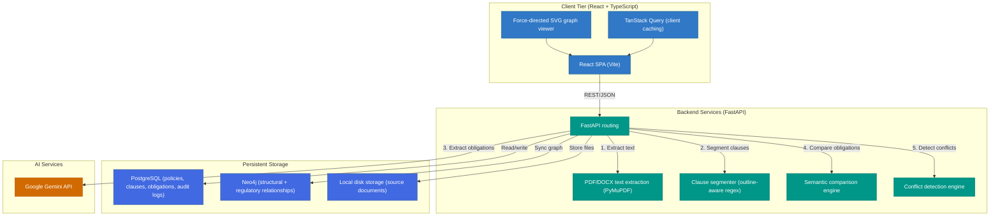
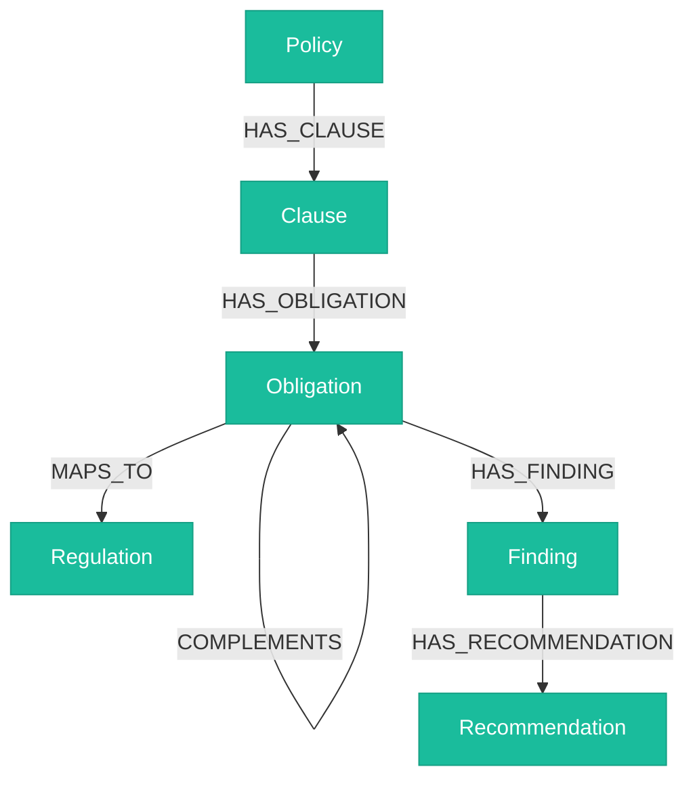

<div align="center">

# 🛡️ PolicySentinel

### AI-Powered Enterprise Policy Intelligence & Governance Platform

**Upload your organization's policy documents. PolicySentinel reads them, finds where they
contradict each other, and drafts the fix.**

[](https://python.org)
[](https://fastapi.tiangolo.com)
[](https://react.dev)
[](https://typescriptlang.org)
[](https://postgresql.org)
[](https://neo4j.com)
[](https://ai.google.dev/)
[](https://docs.docker.com/compose/)

</div>

---

## Table of contents

- [What it does](#what-it-does)
- [Business impact](#business-impact)
- [Key features](#key-features)
- [UI preview](#ui-preview)
- [System architecture](#system-architecture)
- [Technology stack](#technology-stack)
- [Project structure](#project-structure)
- [Getting started](#getting-started)
- [Configuration](#configuration)
- [Development](#development)
- [API reference](#api-reference)
- [Known limitations](#known-limitations)
- [Roadmap](#roadmap)

---

## What it does

As organizations scale, internal policies pile up, overlap, and quietly start contradicting one
another — one document says "delete logs in 24 hours," another says "retain logs for 7 years."
Nobody notices until an audit or an incident forces the question.

PolicySentinel automates the part a compliance team would otherwise do by hand:

1. **Upload** a policy document (PDF, DOCX, or plain text).
2. It's **automatically parsed** into a hierarchy of clauses, and Google Gemini extracts each
   clause's compliance obligation (who must do what, how strongly, under what conditions).
3. Those obligations are **compared against every other policy** the company has on file.
4. Real conflicts — contradictions, duplicates, weakened requirements, mismatched deadlines — are
   **flagged with an AI-drafted recommendation**, ready for a compliance officer to accept or
   reject.
5. Everything is mirrored into a **knowledge graph** and summarized on an **executive dashboard**,
   with a full, immutable audit trail and an exportable PDF report.

**PolicySentinel is not a document management system** — it doesn't just store policies, it reads
and reasons about them.

### Business impact

| Area | Challenge | PolicySentinel impact |
| :--- | :--- | :--- |
| **Audit prep time** | Weeks of manual comparison across hundreds of documents. | Reduced to minutes via automated cross-policy alignment mapping. |
| **Friction & risk** | Conflicting guidelines (e.g. "delete logs in 24 hours" vs. "retain logs for 7 years") create compliance exposure. | Automated semantic, modality-strength, and temporal-constraint detection flags inconsistencies as soon as a policy is uploaded. |
| **M&A integrations** | Aligning acquired companies' compliance frameworks takes months of legal review. | Instantly surfaces overlap mappings, redundant clauses, and structural gaps between two policy sets. |

---

## Key features

- **Structural clause segmentation** — auto-segments uploaded policy text into a nested, hierarchical clause tree using outline-aware parsing.
- **AI obligation extraction** — uses Google Gemini to extract compliance obligations (subject, modality, action, object, category) into structured JSON, with a deterministic rule-based fallback when no API key is configured.
- **Cross-policy conflict detection** — semantically compares obligations across every policy in a company and classifies matches as duplicates, contradictions, or gaps.
- **Modality & temporal analysis** — flags modal-strength shifts (*must* weakened to *should*) and conflicting time constraints (e.g. 90-day vs. 180-day rotations).
- **AI redlining & recommendations** — drafts a suggested resolution for each detected conflict, with an accept/reject review workflow and an immutable audit trail.
- **Regulatory mapping** — links extracted obligations to external framework clauses (GDPR, ISO 27001, RBI, SEBI) and reports coverage/compliance grade.
- **Hybrid knowledge graph** — mirrors policies, clauses, obligations, and their relationships into Neo4j for graph traversal and impact analysis.
- **Executive PDF reports** — generates a downloadable compliance report (score, active conflicts, recommendations, audit trail) on demand.
- **Multi-tenant workspace switching** — a company/workspace switcher in the top bar, with per-company nicknames and dashboard preferences, so every screen is scoped to the tenant you're actually working in.

---

## UI preview

<details>
<summary>Representative views</summary>
<br>

**Executive Dashboard** (`/`)
```
+-----------------------------------------------------------------------------+
| PolicySentinel          [Acme Global Corporation ▾]              [Theme]    |
|                                                                             |
|  +--------------------+  +--------------------+  +-----------------------+  |
|  | Compliance Score   |  | Active Conflicts   |  | Pending Recommend.    |  |
|  |      84 / 100      |  |         12         |  |          5            |  |
|  |    Risk: Low        |  |  (3 High Severity)  |  |                       |  |
|  +--------------------+  +--------------------+  +-----------------------+  |
|                                                                             |
|  Immutable Compliance Audit History                                        |
|  - Text extraction completed for IT_Security_Policy_v1.pdf                 |
|  - High-severity conflict detected: "Managed device access only"           |
+-----------------------------------------------------------------------------+
```

**Conflict Dashboard** (`/conflicts`)
```
+-----------------------------------------------------------------------------+
| Conflict Dashboard                     [Type ▾] [Severity ▾] [Status ▾]     |
|                                                                             |
|  Contradiction | IT Security Policy v1 → Remote Work Policy v2 | High       |
|    Source: "Managed laptops only"  vs.  Target: "Personal devices allowed" |
|    AI Recommendation: enforce BYOD MDM profiles.        [Accept] [Reject]  |
+-----------------------------------------------------------------------------+
```

**Knowledge Graph** (`/knowledge-graph`)
```
+-----------------------------------------------------------------------------+
| Knowledge Graph Explorer                                    [Reset zoom]    |
|                                                                             |
|         (Policy) --[HAS_CLAUSE]--> (Clause) --[HAS_OBLIGATION]--> (Ob.)     |
|                                                                             |
|   (ISO 27001) <--[MAPS_TO]-- (Obligation A) --[CONFLICTS_WITH]-- (Ob. B)   |
+-----------------------------------------------------------------------------+
```

**Settings** (`/settings`)
```
+-----------------------------------------------------------------------------+
| Company directory          [Acme Global Corp. ▾ Active] [Save name]         |
| Dashboard preferences       Default landing page: Reports                   |
|                             Rows per page: 20                               |
+-----------------------------------------------------------------------------+
```
</details>

---

## System architecture



### Ingestion pipeline

Uploading a policy document runs this pipeline synchronously, end to end, in a single request:


### Graph schema



---

## Technology stack

| Layer | Technology | Notes |
| :--- | :--- | :--- |
| **Frontend** | React 19, TypeScript 6, Vite 8, Tailwind CSS 4, TanStack Query, React Router 7 | SPA served by Vite in dev, Nginx in the production Docker image. |
| **Backend** | FastAPI 0.139, Python 3.11, Uvicorn, SQLAlchemy 2 | Versioned REST API (`/api/v1`), synchronous ingestion pipeline. |
| **Relational DB** | PostgreSQL 16 | Policy/clause/obligation metadata, conflicts, recommendations, immutable audit log. |
| **Graph DB** | Neo4j 5 (Community) | Mirrors relational data into a traversable graph for impact analysis. |
| **AI / LLM** | Google Gemini (`gemini-2.5-flash` by default) | Obligation extraction, conflict explanations, and recommendations. Falls back to a deterministic rule-based mock when no `GEMINI_API_KEY` is set. |
| **Document parsing** | PyMuPDF, `python-docx`, `pypdf` | PDF/DOCX/plain-text extraction. |
| **PDF generation** | PyMuPDF (`fitz`) | Builds the executive compliance report on demand. |
| **Containerization** | Docker Compose | Brings up Postgres, Neo4j, backend, and frontend together for local development. |

---

## Project structure

```
PolicySentinel/
├── backend/
│   ├── ai/                    # Documentation placeholder only — no code yet.
│   ├── alembic/                # Database migrations (run `alembic upgrade head` before first use).
│   ├── api/v1/endpoints/       # FastAPI routers — one file per resource.
│   ├── auth/                  # Documentation placeholder only — see "Known limitations" below.
│   ├── database/               # SQLAlchemy engine/session setup.
│   ├── domain/                 # Entities, interfaces, and domain exceptions.
│   ├── graph/                  # Neo4j client + graph population service.
│   ├── models/                 # SQLAlchemy ORM models.
│   ├── parsing/                 # PDF/DOCX/text extraction.
│   ├── reasoning/              # Documentation placeholder only — no code yet.
│   ├── repositories/            # Persistence implementations (file storage, clauses).
│   ├── schemas/                 # Pydantic request/response models.
│   ├── services/                # Business logic — ingestion, comparison, scoring, reports.
│   │   ├── ai/                  # All Gemini integration (extraction, explanations, recommendations) lives here.
│   │   └── comparison/          # Semantic comparison + conflict detection engine.
│   ├── main.py                  # FastAPI app bootstrap.
│   └── requirements.txt
├── frontend/
│   └── src/
│       ├── components/          # Shared UI (layout, upload, clause/obligation viewers).
│       ├── contexts/            # ThemeContext, WorkspaceContext (active company + preferences).
│       ├── hooks/                # TanStack Query hooks + workspace/company-directory hooks.
│       ├── pages/                # Route-level views (Dashboard, Upload, Conflicts, Settings, ...).
│       ├── services/             # Axios API clients, one per backend resource.
│       ├── utils/                 # Validation, workspace identity/preferences (localStorage).
│       ├── App.tsx
│       └── main.tsx
├── demo-data/                    # Sample policy PDFs used by DEMO.md.
├── scripts/setup/                # `reset_db_clean.py`, `seed_demo_data.py`, `generate_demo_pdfs.py`.
├── tests/backend/                 # unit / integration / e2e pytest suites.
├── docs/architecture/             # Design-stage architecture notes (predates this implementation).
├── docker/                        # Per-service Dockerfiles + Neo4j/Postgres config.
└── docker-compose.yml
```

`ai/`, `auth/`, and `reasoning/` each contain only a `README.md` describing an intended
responsibility that was never implemented against — see [Known limitations](#known-limitations).

---

## Getting started

### Option A — Docker Compose (recommended)

Brings up PostgreSQL, Neo4j, the FastAPI backend (hot reload), and the Vite dev server together.

**Prerequisites:** Docker Desktop, a Google Gemini API key (optional — see [below](#known-limitations)).

```bash
git clone <this-repository>
cd PolicySentinel
cp .env.example .env        # edit GEMINI_API_KEY if you have one; defaults work otherwise
docker compose up -d --build
```

Then apply database migrations and seed the demo tenant (run once, on first start):

```bash
docker exec -w /app/backend policysentinel-backend alembic upgrade head

# scripts/ isn't bind-mounted into the container (only backend/ is), so copy
# it in before running the seed script — a one-time step per container:
docker cp scripts policysentinel-backend:/app/scripts
docker exec -w /app policysentinel-backend python -m scripts.setup.reset_db_clean
```

| Service | URL |
| :--- | :--- |
| Frontend | http://localhost:3000 |
| Backend API | http://localhost:8000 |
| API docs (Swagger) | http://localhost:8000/docs |
| Neo4j Browser | http://localhost:7474 |

Follow [DEMO.md](DEMO.md) for a guided walkthrough (upload two sample policies and watch the
conflict-detection pipeline run end to end).

### Option B — Run natively

**Prerequisites:** Python 3.11, Node.js 18+, PostgreSQL 16, a Neo4j 5 instance.

```bash
# Backend
cd backend
python -m venv venv && venv\Scripts\activate   # source venv/bin/activate on Linux/macOS
pip install -r requirements.txt
alembic upgrade head
uvicorn backend.main:app --reload               # http://localhost:8000

# Frontend (separate shell)
cd frontend
npm install
npm run dev                                      # http://localhost:3000

# Seed a clean demo tenant (from the repo root, separate shell)
python scripts/setup/reset_db_clean.py
python scripts/setup/generate_demo_pdfs.py
```

---

## Configuration

Copy `.env.example` to `.env` and adjust as needed. The values actually read by the running
application are:

| Variable | Purpose |
| :--- | :--- |
| `DATABASE_URL` / `POSTGRES_*` | PostgreSQL connection. |
| `NEO4J_URI`, `NEO4J_USER`, `NEO4J_PASSWORD` | Neo4j connection. |
| `GEMINI_API_KEY`, `GEMINI_MODEL` | Google Gemini access. Extraction/comparison silently falls back to a rule-based mock if unset. |
| `UPLOAD_DIR`, `MAX_UPLOAD_SIZE_MB` | Local policy-document storage. |
| `CORS_ALLOWED_ORIGINS` | Origins the API will accept requests from. |
| `VITE_API_BASE_URL` | Base URL the frontend calls (includes the `/api/v1` prefix). |

`JWT_*`, `ANTHROPIC_API_KEY`, and `CLAUDE_MODEL` are present in `.env.example` but currently
unused — see [Known limitations](#known-limitations).

---

## Development

```bash
# Frontend
npm run dev         # Vite dev server
npm run build        # tsc -b && vite build
npm run typecheck     # tsc -b --noEmit
npm run lint           # eslint .

# Backend
pytest                       # unit + integration + e2e suites (see tests/backend/)
alembic revision --autogenerate -m "..."   # new migration
alembic upgrade head                        # apply pending migrations
```

---

## API reference

All routes are mounted under `/api/v1`. None currently require authentication (see below).

| Resource | Routes |
| :--- | :--- |
| **Policies** | `GET /policies`, `GET /policies/{id}`, `DELETE /policies/{id}`, `GET /policies/{id}/download` |
| **Uploads** | `POST /uploads/policies` — stores the document and runs the full ingestion pipeline (extraction → segmentation → obligation extraction → comparison → conflict detection → recommendations → Neo4j sync) synchronously. |
| **Clauses** | `GET /clauses`, `GET /clauses/{id}` |
| **Obligations** | `GET /obligations`, `GET /obligations/{id}` |
| **Comparison** | `POST /comparison/compare` — on-demand semantic comparison between two policy versions. |
| **Conflicts** | `GET /conflicts`, `GET /conflicts/{id}`, `PATCH /conflicts/{id}/status` |
| **Recommendations** | `GET /recommendations`, `GET /recommendations/{id}`, `PATCH /recommendations/{id}/status` |
| **Compliance dashboard** | `GET /compliance-dashboard/summary`, `GET /compliance-dashboard/audit-logs`, `GET /compliance-dashboard/download` (PDF report) |
| **Relationships** | `GET /relationships`, `GET /relationships/{id}` |
| **Advanced findings** | `GET /findings`, `GET /findings/temporal`, `GET /findings/strength`, `GET /findings/stale`, `GET /findings/{id}` |
| **Regulatory mappings** | `GET /regulatory-mappings`, `GET /regulatory-mappings/frameworks`, `GET /regulatory-mappings/frameworks/{id}/clauses`, `GET /regulatory-mappings/health/{policy_id}`, `POST /regulatory-mappings/remap/{obligation_id}` |
| **Knowledge graph** | `GET /graph/policy/{id}`, `GET /graph/policy/{id}/impact`, `GET /graph/obligation/{id}`, `GET /graph/search` |
| **Debug** | `GET /debug/extract/{policy_id}` — raw PDF text extraction, for local troubleshooting only. |

Full interactive documentation is available at `/docs` while the backend is running.

---

## Known limitations

Being upfront about the gap between what's documented as intended and what's actually wired up:

- **No authentication is enforced.** Every route above is open. A `User` model with hashed
  passwords and roles exists, and `python-jose` is installed, but there is no login endpoint and no
  `get_current_user` dependency — the Upload page asks for a plain Company ID / User ID instead of a
  session.
- **No formal reasoning engine.** `z3-solver` is a listed dependency and `backend/reasoning/`
  documents an intended Z3-based formal-contradiction checker, but nothing imports `z3` anywhere in
  the codebase. All conflict detection today is Gemini/rule-based semantic comparison, not a
  provable logical contradiction.
- **Gemini is optional but recommended.** Without a real `GEMINI_API_KEY`, obligation extraction
  falls back to a generic rule-based mock, which tends to produce near-identical obligation text for
  unrelated clauses — you'll see a wave of low-severity "duplicate" conflicts instead of the richer
  mix (modality shifts, temporal mismatches) the pipeline is capable of with real extraction.
- **No company directory endpoint.** The frontend's workspace/company switcher discovers companies
  by grouping existing policies client-side, since there's no `/companies` API — company display
  names are user-assigned nicknames stored in the browser, not server-side data.
- **No `LICENSE` file is committed yet**, despite the MIT intent below.

---

## Roadmap

- [ ] Wire up JWT authentication (`python-jose` dependency is already present) and role-based access control.
- [ ] Implement the Z3-backed formal reasoning engine for provable (not just inferred) contradictions.
- [ ] Add a `/companies` endpoint so company names don't rely on client-side nicknames.
- [ ] Real-time regulatory-framework updates (scraping GDPR/RBI registries instead of a static seed).
- [ ] Side-by-side redline diffing between policy version drafts.

---

## License

Intended to be MIT-licensed; a `LICENSE` file has not yet been added to this repository.

---

## Acknowledgements

- [Google AI Studio (Gemini API)](https://ai.google.dev/)
- [FastAPI](https://fastapi.tiangolo.com)
- [Neo4j](https://neo4j.com)
- [PyMuPDF](https://pymupdf.readthedocs.io/)
