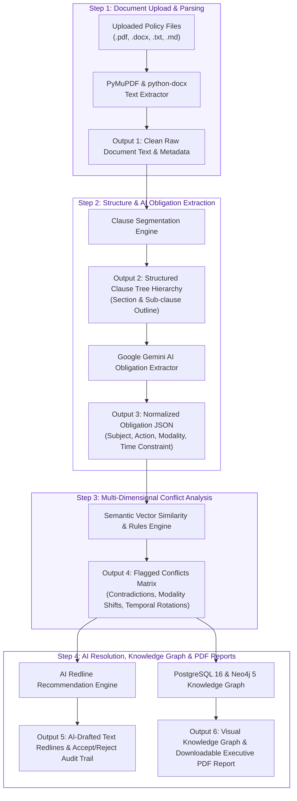

<div align="center">

# Policy Conflict & Staleness Detector
### PolicySentinel — Policy Conflict Detection & Compliance Intelligence Platform

Automate policy cross-referencing. Detect hidden contradictions, modality shifts, and temporal mismatches across corporate documents with AI-drafted redline resolutions.

</div>

---

## The Problem
Modern organizations face significant compliance risks and operational friction due to policy fragmentation:
* **Silent Policy Contradictions**: Different departments publish conflicting mandates (e.g., InfoSec requiring log deletion after 90 days, while Legal requires retention for 7 years).
* **Manual Audit Bottlenecks**: Compliance teams spend weeks manually cross-referencing hundreds of document pages before regulatory audits.
* **Modality Shifts (Erosion)**: Critical mandates (*"Must encrypt mobile devices"*) are diluted to discretionary suggestions (*"Should encrypt mobile devices"*) in newer policy versions.
* **M&A Policy Friction**: Merging corporate policies during corporate acquisitions creates overlapping, conflicting operational rules.
* **Policy Staleness**: Outdated policies remain active without review, creating security gaps and compliance violations.

---

## The Proposed Solution
PolicySentinel transforms document reviews into an automated compliance workflow:

```
[Uploaded Document] 
       │
       ▼
[Clause Segmentation] ──► Extracts paragraphs, hierarchy, and section trees
       │
       ▼
[AI Obligation Parser] ──► Converts prose to structured JSON (Subject, Modality, Action)
       │
       ▼
[Conflict & Staleness Engine] ──► Analyzes contradictions, temporal mismatches, and age
       │
       ▼
[Actionable Redlines] ──► Generates AI-drafted inline resolutions and Cypher graphs
```

---

## System Architecture & Execution Flow
The diagram below details the ingestion and processing flow:



---

## Technology Stack

| Layer | Technology | Why It Was Used |
| :--- | :--- | :--- |
| **Frontend** | React 19, TypeScript 5.7, Tailwind CSS, Vite | Provides a highly responsive, type-safe interactive UI. Vite ensures fast Hot Module Replacement (HMR) during development. |
| **Backend** | FastAPI 0.141, Python 3.11+ | Asynchronous high-performance REST API. Automatically generates Swagger docs and integrates easily with ML/AI libraries. |
| **Relational DB** | PostgreSQL 16 | Handles structured configuration, company metadata, user credentials, and audit logs with ACID compliance. |
| **Graph DB** | Neo4j 5 | Stores policy hierarchies and obligation dependencies. Cypher queries enable fast impact analysis and relationship traversals. |
| **AI Processing** | Google Gemini AI | Performs obligation parsing and policy contradiction redlining via schema-enforced JSON generation. |
| **Doc Parsing** | PyMuPDF, python-docx | Natively parses PDF and Word files without complex cloud dependencies. |
| **Formal Logic** | Z3 Solver | Validates logical contradictions and checks modality strengths mathematically. |

---

## Installation & Execution Guide

### Option A: Docker Compose (Recommended)
This runs the entire stack in isolated containers.

```bash
# 1. Clone the repository
git clone https://github.com/Sangamithraa077/PolicySentinel.git
cd PolicySentinel

# 2. Configure environment
cp .env.example .env

# 3. Build & start containers
docker compose up -d --build

# 4. Migrate database & seed demo data
docker exec -w /app/backend policysentinel-backend alembic upgrade head
docker cp scripts policysentinel-backend:/app/scripts
docker exec -w /app policysentinel-backend python -m scripts.setup.seed_demo_data
```

| Service | Local URL |
| :--- | :--- |
| **Frontend Web App** | [http://localhost:3000](http://localhost:3000) |
| **Backend REST API** | [http://localhost:8000](http://localhost:8000) |
| **Swagger API Docs** | [http://localhost:8000/docs](http://localhost:8000/docs) |
| **Neo4j Browser** | [http://localhost:7474](http://localhost:7474) |

---

### Option B: Native Local Execution
Use this if you are running the backend and frontend services directly on your host machine.

```bash
# 1. Start Postgres & Neo4j containers
docker compose up -d postgres neo4j

# 2. Start Backend API (Terminal 1)
cd backend
python -m venv venv
# Windows: .\venv\Scripts\activate | macOS/Linux: source venv/bin/activate
pip install -r requirements.txt
python -m alembic upgrade head
python -m uvicorn backend.main:app --host 0.0.0.0 --port 8000 --reload

# 3. Start Frontend App (Terminal 2)
cd frontend
npm install
npm run dev
```

---

## Future Implementation Roadmap

We plan to expand the intelligence capabilities of PolicySentinel:

* **Interactive RAG Chatbot**: Integrate a Retrieval-Augmented Generation (RAG) chatbot using the Neo4j Knowledge Graph. Users will be able to query policies in natural language (e.g., *"What is our policy on remote password rotation?"* or *"Are there any contradictions regarding logs?"*) and receive contextual answers linked directly to clauses.
* **Agentic Conflict Resolution**: Multi-agent consensus models to negotiate and automatically draft reconciled policies.
* **Continuous Compliance Sync**: Real-time webhook listeners for OneDrive, Google Drive, and SharePoint to scan new policy versions on upload.

<div align="center">

PolicySentinel makes regulatory compliance audit-ready and automated. By resolving contradictions and addressing policy staleness, the platform protects organizations from compliance risks before they attract auditor attention.

*Engineered with care to keep your compliance seamless and risk-free.* ❤️

</div>
