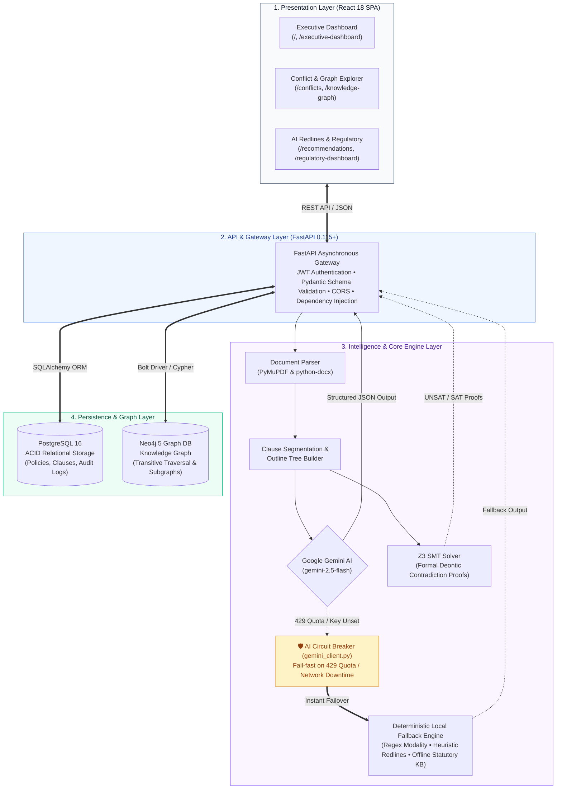
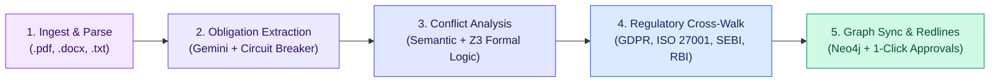

<div align="center">

# PolicySentinel
### Autonomous Policy Conflict Detection, Regulatory Mapping & Compliance Intelligence Platform

Automate enterprise policy cross-referencing. Detect hidden contradictions, modality erosions, and temporal mismatches across corporate documents with AI-drafted redline resolutions, interactive Neo4j knowledge graphs, and multi-framework regulatory mapping.

[](https://fastapi.tiangolo.com)
[](https://react.dev)
[](https://www.typescriptlang.org)
[](https://www.postgresql.org)
[](https://neo4j.com)
[](https://ai.google.dev)

</div>

---

## The Problem
Modern enterprise organizations face severe compliance risks and operational overhead caused by fragmented, siloed policies:
* **Silent Policy Contradictions**: Disjointed departments publish conflicting mandates (e.g., Information Security mandating 90-day log deletion, while Legal retains logs for 7 years).
* **Modality Erosion**: Crucial mandates (*"Employees MUST encrypt portable media"*) get diluted over revisions into discretionary guidance (*"Employees SHOULD encrypt portable media"*).
* **M&A and Departmental Overlaps**: Merging corporate policies during acquisitions creates duplicate, contradictory operational rules.
* **Regulatory Compliance Blindspots**: Organizations struggle to map internal obligations directly against external frameworks like GDPR, ISO 27001, SEBI, and RBI.
* **Manual Audit Fatigue**: Compliance teams spend hundreds of hours manually comparing document pages ahead of external regulatory audits.

---

## System Architecture & Execution Flow

PolicySentinel is engineered with a **4-tier Clean Architecture** coupled with a high-availability **AI Circuit Breaker & Local Deterministic Engine**:



---

### End-to-End Execution Flow (The 5-Stage Pipeline)

Every policy uploaded to PolicySentinel traverses an automated, deterministic 5-stage compliance pipeline:



#### 1. Ingestion & Hierarchical Clause Parsing
- **Inputs**: Corporate document uploads (`.pdf`, `.docx`, `.txt`, `.md`).
- **Processing**: [PyMuPDF](https://pymupdf.readthedocs.io/) and `python-docx` extract raw text, typography, headings, and metadata.
- **Output**: A structured, numbered clause outline tree preserving indentation, sub-clauses, and parent-child document hierarchy.

#### 2. AI Obligation Extraction with Circuit Breaker
- **Primary Processing**: Google Gemini 2.5 Flash analyzes each clause with strict Pydantic JSON schemas, breaking legalese into structured quadruples: `[Subject, Modality, Action, Object]`.
- **🛡️ Circuit Breaker Resilience**: If Google Gemini API quota is exhausted (HTTP 429 `RESOURCE_EXHAUSTED`) or network connectivity drops, the global circuit breaker (`gemini_client.py`) fail-fast trips to our **Local Deterministic Fallback Engine** (regex deontic parsing: `MUST`, `SHALL`, `SHOULD`, `MAY`). **Zero downtime, zero 500 errors.**

#### 3. Multi-Dimensional Conflict Analysis & Formal Verification
- **Dual-Engine Detection**:
  - **Semantic Comparison Engine**: Computes pairwise cosine and token similarity across organizational policies to detect semantic divergence.
  - **Z3 Theorem Prover**: Formulates formal deontic logic formulas to mathematically prove satisfiability (SAT) vs irreconcilable contradictions (UNSAT).
- **Taxonomy Detected**: Direct Contradictions, Modality Erosion (`MUST` downgraded to `SHOULD`), Temporal Rot (conflicting retention windows like 90 days vs 7 years), Scope Overlaps, and Threshold Discrepancies.

#### 4. Regulatory Knowledge Base Mapping
- **Statutory Frameworks**: Simultaneously cross-references extracted obligations against built-in compliance baselines:
  - **GDPR** (Articles 5, 17, 30, 32, 33)
  - **ISO/IEC 27001** (Annex A Controls)
  - **SEBI Cybersecurity & Cyber Resilience Framework (CSCRF)**
  - **RBI Master Direction on IT Governance & Cybersecurity**
- **Output**: Clause-level statutory citations, gap classifications, and policy compliance grades (A/B/C).

#### 5. Knowledge Graph Synchronization, AI Redlines & Executive PDF
- **Neo4j Knowledge Graph**: Syncs policy nodes, clause hierarchies, obligation relationships (`CONFLICT`, `REDUNDANT`, `COMPLEMENTARY`), and impact paths into Neo4j 5. Compliance officers can visually traverse multi-hop impact radius queries.
- **Actionable AI Redlines**: Generates side-by-side redline recommendations with one-click **Accept / Reject** human-in-the-loop audit logging.
- **Executive Audit Export**: One-click generation of audit-ready compliance PDF reports complete with executive scores, risk distributions, and timestamped audit trails.


---

## Core Modules & Platform Features

| Module | Route / Page | Capabilities |
| :--- | :--- | :--- |
| **Executive Dashboard** | `/` or `/executive-dashboard` | Executive Compliance Score dial (0–100), active/resolved conflict counts, pending recommendations, risk distribution matrix, and audit trail. |
| **Policy Library** | `/policies` | Centralized corporate policy repository with real-time text search, department categorization, version tracking, and direct clause drilling. |
| **Policy Ingestion** | `/upload` | Ingestion of PDF, DOCX, TXT documents with custom Company and Uploader names, live progress tracking, and multi-tenant user provisioning. |
| **Clause Viewer** | `/clauses` | Clause hierarchy navigation, clause numbering, text preview, confidence scoring, and policy filtering. |
| **Obligation Viewer** | `/obligations` | Modality filtering (`MUST`, `SHALL`, `SHOULD`, `MAY`), structured Subject-Action-Object triples, and source clause links. |
| **Conflict Dashboard** | `/conflicts` | Side-by-side clause comparison, conflict taxonomy (Direct Contradiction, Modality Erosion, Temporal Mismatch, Scope Overlap, Threshold Discrepancy). |
| **AI Redlines & Approvals** | `/recommendations` | AI-generated redlines and suggested actions with one-click **Accept / Reject** human-in-the-loop audit logging. |
| **Obligation Relationships** | `/relationships` | Cross-policy obligation categorizations: `CONFLICT`, `REDUNDANT`, `COMPLEMENTARY`, `UNRELATED`. |
| **Advanced Findings** | `/findings` | In-depth cross-policy findings matrix with severity breakdowns. |
| **Regulatory Knowledge Base** | `/regulatory-dashboard` | Real-time mapping against **GDPR**, **ISO 27001**, **SEBI Cybersecurity Framework**, and **RBI Master Direction**, plus per-policy Health Scores (A/B/C grades). |
| **Neo4j Knowledge Graph** | `/knowledge-graph` | Interactive visual node-edge graph, policy impact analysis traversals, and semantic entity search. |
| **Guided Demo Mode** | `/demo-mode` | Interactive step-by-step walkthrough simulating policy upload, conflict detection, knowledge graph traversal, and redline resolution. |
| **Audit Logs & PDF Reports** | `/reports` | Immutable activity trail with exportable, signed executive compliance PDF reports (`/api/v1/compliance-dashboard/download`). |
| **Multi-Company Directory** | *Topbar* | Dynamic tenant switcher separating multiple corporate entities with accurate, isolated policy counts. |

---

## Technology Stack

| Layer | Technology | Version | Purpose & Rationale |
| :--- | :--- | :--- | :--- |
| **Frontend UI** | React, TypeScript, Tailwind CSS, Vite | React 18.3, TS 5.7 | High-performance reactive UI with responsive data tables, dials, and dark/light mode. |
| **Backend REST API** | FastAPI, Python | Python 3.11+, FastAPI 0.115+ | High-throughput asynchronous backend with auto-generated OpenAPI documentation. |
| **Relational Database** | PostgreSQL, SQLAlchemy, Alembic | PostgreSQL 16 | ACID-compliant transactional storage for companies, users, policies, clauses, conflicts, and audit trails. |
| **Knowledge Graph** | Neo4j, Bolt Driver | Neo4j 5 Community | High-performance graph database storing policy hierarchies, obligation relationships, and impact analysis paths. |
| **AI & LLM Services** | Google Gemini AI | `google-genai` SDK | Clause extraction, obligation decomposition, regulatory mapping, and redline drafting with schema-enforced JSON. |
| **Document Parsers** | PyMuPDF, python-docx | Latest | Fast, robust local extraction of text, tables, and metadata from PDF and Word documents. |
| **Formal Reasoning** | Z3 Theorem Prover | `z3-solver` | Mathematical validation of deontic logic and modality contradictions. |

---

## Installation & Execution Guide

### Option A: Docker Compose (Recommended)

Runs the entire stack in orchestrated, health-checked containers:

```bash
# 1. Clone repository
git clone https://github.com/Sangamithraa077/PolicySentinel.git
cd PolicySentinel

# 2. Configure environment
cp .env.example .env
# Edit .env and supply your GEMINI_API_KEY if testing live AI generation

# 3. Build & start all 4 services
docker compose up -d --build

# 4. Run database migrations & seed demo dataset
docker exec -w /app/backend policysentinel-backend alembic upgrade head
docker exec -w /app policysentinel-backend python -m scripts.setup.seed_demo_data
```

#### Service URLs & Default Credentials

| Service | URL | Credentials / Notes |
| :--- | :--- | :--- |
| **Frontend Web Application** | [http://localhost:3000](http://localhost:3000) | Hot-reloading React dashboard |
| **Backend REST API** | [http://localhost:8000](http://localhost:8000) | Root API endpoint |
| **Interactive Swagger Docs** | [http://localhost:8000/docs](http://localhost:8000/docs) | Complete interactive endpoint testing |
| **PostgreSQL Database** | `localhost:5433` (container port `5432`) | User: `policysentinel`, Password: `changeme`, DB: `policysentinel` |
| **Neo4j Graph Browser** | [http://localhost:7474](http://localhost:7474) | User: `neo4j`, Password: `changeme`, Bolt: `bolt://localhost:7687` |

---

### Option B: Native Local Execution

Run services natively on host machines:

```bash
# 1. Start Postgres & Neo4j database containers
docker compose up -d postgres neo4j

# 2. Start Backend API (Terminal 1)
cd backend
python -m venv venv
# Windows: .\venv\Scripts\activate | macOS/Linux: source venv/bin/activate
pip install -r requirements.txt
alembic upgrade head
cd ..
uvicorn backend.main:app --host 0.0.0.0 --port 8000 --reload

# 3. Start Frontend App (Terminal 2)
cd frontend
npm install
npm run dev
```

---

## Future Implementation Roadmap

* **Interactive RAG Policy Chatbot**: Knowledge Graph-augmented natural language interface allowing auditors to ask questions (*"What is our maximum retention period for customer PII across all subsidiaries?"*) and receive citation-backed answers.
* **Agentic Multi-Party Reconciler**: Autonomous multi-agent negotiations proposing consensus policy text across cross-departmental stakeholders.
* **Continuous Cloud Webhook Ingestion**: Webhooks for SharePoint, Google Drive, and OneDrive for automated real-time compliance diffing on document updates.

<div align="center">

PolicySentinel delivers enterprise compliance assurance through automated policy cross-referencing, formal logic validation, and AI-powered redlines.

*Built with precision for robust, audit-ready compliance.❤️*

</div>
