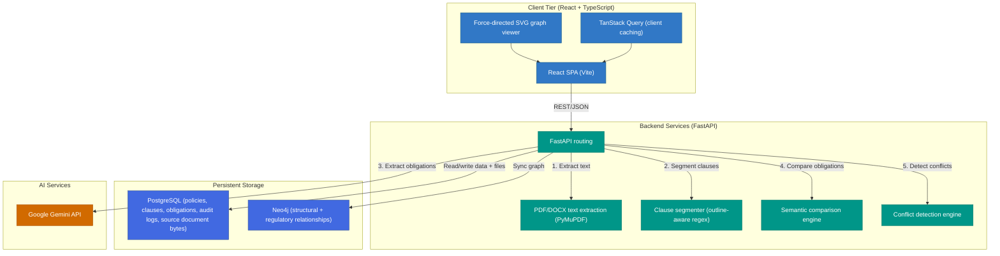
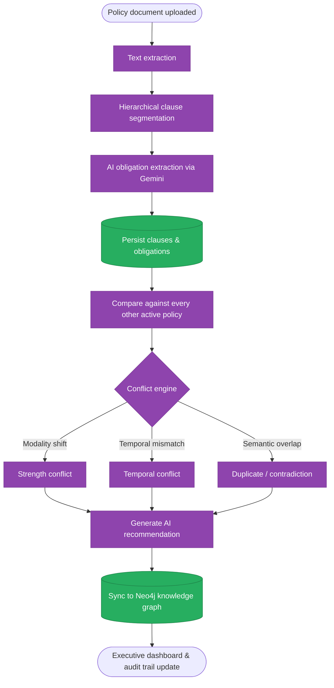
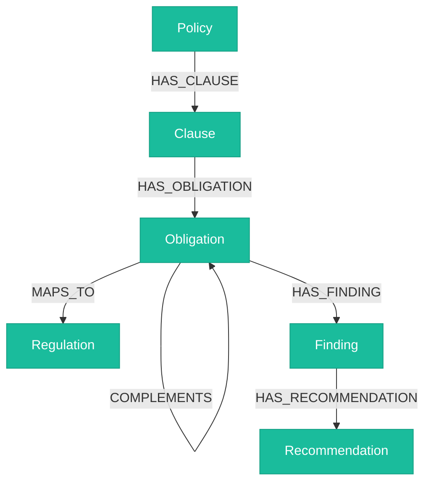

<div align="center">

# 🛡️ PolicySentinel

### AI-powered policy conflict detection for financial institutions

**Upload your policies. PolicySentinel reads them, finds where they contradict each other, and drafts the fix.**

[](https://python.org)
[](https://fastapi.tiangolo.com)
[](https://react.dev)
[](https://typescriptlang.org)
[](https://postgresql.org)
[](https://neo4j.com)
[](https://ai.google.dev/)
[](https://docs.docker.com/compose/)

**[Live app →](https://policysentinel-frontend.onrender.com)** &nbsp;·&nbsp; **[API →](https://policysentinel-backend.onrender.com)** &nbsp;·&nbsp; **[API docs →](https://policysentinel-backend.onrender.com/docs)**

</div>

---

## Contents

<table>
<tr>
<td valign="top" width="50%">

- 🎯 [What it does](#what-it-does)
- ✨ [Features](#features)
- 🏗️ [Architecture](#architecture)
- 🧰 [Tech stack](#tech-stack)
- 🗂️ [Project structure](#project-structure)
- 🚀 [Getting started](#getting-started)

</td>
<td valign="top" width="50%">

- 🔧 [Configuration](#configuration)
- 💻 [Development](#development)
- ☁️ [Deployment](#deployment)
- 📡 [API reference](#api-reference)
- ⚠️ [Known limitations](#known-limitations)

</td>
</tr>
</table>

---

## 🎯 What it does

Policies pile up as an organization grows, and they quietly start contradicting each other — one
document says *delete logs in 24 hours*, another says *retain logs for 7 years*. Nobody notices
until an audit forces the question.

PolicySentinel automates the part a compliance team would otherwise do by hand:

1. **Upload** a policy (PDF, DOCX, TXT, or MD).
2. **Documents are read automatically** — Text is extracted from PDF, DOCX, TXT, or MD files, and Gemini extracts every clause's obligation: who must do what, how strongly, under what conditions.
3. Each obligation is **compared against every other policy** on file.
4. Real conflicts — contradictions, duplicates, weakened requirements — are **flagged with an
   AI-drafted fix**, ready to accept or reject.
5. Everything lands in a **knowledge graph** and an **executive dashboard**, with a permanent audit
   trail and an exportable PDF report.

It's not a document store. It reads and reasons about what it stores.

| | |
| :--- | :--- |
| **Audit prep** | Weeks of manual cross-referencing → minutes of automated mapping. |
| **Risk** | Contradictions surface the moment a policy is uploaded, not during an audit. |
| **M&A integration** | Overlaps and gaps between two companies' policy sets, instantly. |

---

## ✨ Features

- **Clause segmentation** — parses uploaded text into a hierarchical clause tree with rule-based outline matching and AI structure fallback.
- **AI obligation extraction** — Gemini extracts subject / modality / action / object / category as structured JSON, with a rule-based fallback if no API key is set.
- **Conflict detection** — semantically compares obligations across every policy a company has, classifying duplicates, contradictions, and gaps.
- **Modality & temporal analysis** — catches *must* quietly weakened to *should*, and mismatched time constraints (90-day vs. 180-day rotations).
- **AI redlining** — a drafted resolution for every conflict, with accept/reject and a permanent audit trail.
- **Regulatory mapping** — links obligations to GDPR, ISO 27001, RBI, and SEBI clauses.
- **Knowledge graph** — policies, clauses, and obligations mirrored into Neo4j for traversal and impact analysis.
- **Executive PDF reports** — score, conflicts, recommendations, audit trail, on demand.
- **Multi-tenant workspaces** — a company switcher with per-company nicknames, scoping every screen to the tenant you're working in.

---

## 🏗️ Architecture



All uploaded documents (PDF, DOCX, TXT, MD) run this ingestion pipeline automatically from start to finish upon upload.

<details>
<summary><strong>Ingestion pipeline, step by step</strong></summary>
<br>



</details>

<details>
<summary><strong>Graph schema</strong></summary>
<br>



</details>

---

## 🧰 Tech stack

| Layer | Technology |
| :--- | :--- |
| **Frontend** | React 19, TypeScript 6, Vite 8, Tailwind CSS 4, TanStack Query, React Router 7 |
| **Backend** | FastAPI, Python 3.11, Uvicorn, SQLAlchemy 2 |
| **Relational DB** | PostgreSQL 16 — policies, clauses, obligations, conflicts, audit log |
| **Graph DB** | Neo4j 5 — structural & regulatory relationships |
| **AI** | Google Gemini (`gemini-2.5-flash`), with a deterministic rule-based fallback when no API key is set |
| **Document parsing** | PyMuPDF, `python-docx`, `pypdf` |
| **Containers** | Docker Compose — Postgres, Neo4j, backend, and frontend together for local dev |

---

## 🗂️ Project structure

```
PolicySentinel/
├── backend/
│   ├── alembic/          # DB migrations — `alembic upgrade head` before first use
│   ├── api/v1/endpoints/  # FastAPI routers, one file per resource
│   ├── database/          # SQLAlchemy engine/session setup
│   ├── domain/            # Entities, interfaces, domain exceptions
│   ├── graph/             # Neo4j client + graph population
│   ├── models/            # SQLAlchemy ORM models
│   ├── parsing/           # PDF/DOCX/text extraction
│   ├── repositories/      # Persistence implementations (file storage, clauses)
│   ├── schemas/           # Pydantic request/response models
│   ├── services/          # Ingestion, comparison, scoring, reports
│   │   ├── ai/             # Gemini integration
│   │   └── comparison/     # Semantic comparison + conflict detection
│   └── main.py             # FastAPI app bootstrap
├── frontend/src/
│   ├── components/         # Layout, upload, clause/obligation viewers
│   ├── contexts/           # ThemeContext, WorkspaceContext
│   ├── hooks/              # TanStack Query hooks
│   ├── pages/               # Route-level views
│   ├── services/            # Axios API clients, one per resource
│   └── App.tsx / main.tsx
├── demo-data/               # Sample PDFs for DEMO.md
├── scripts/setup/            # Seed and reset scripts
├── tests/backend/             # unit / integration / e2e
├── docker/                     # Dockerfiles + Neo4j/Postgres config
└── docker-compose.yml
```

`backend/ai/`, `backend/auth/`, and `backend/reasoning/` are documentation placeholders — see [Known limitations](#known-limitations).

---

## 🚀 Getting started

### Docker Compose (recommended)

```bash
git clone <this-repository>
cd PolicySentinel
cp .env.example .env        # add GEMINI_API_KEY if you have one — defaults work otherwise
docker compose up -d --build
```

Then, once, on first start:

```bash
docker exec -w /app/backend policysentinel-backend alembic upgrade head

# scripts/ isn't bind-mounted (only backend/ is) — copy it in once per container:
docker cp scripts policysentinel-backend:/app/scripts
docker exec -w /app policysentinel-backend python -m scripts.setup.reset_db_clean
```

| Service | URL |
| :--- | :--- |
| Frontend | http://localhost:3000 |
| Backend API | http://localhost:8000 |
| API docs | http://localhost:8000/docs |
| Neo4j Browser | http://localhost:7474 |

Then follow [DEMO.md](DEMO.md) for a guided walkthrough.

### Run natively

```bash
# Backend
cd backend
python -m venv venv && venv\Scripts\activate   # source venv/bin/activate on Linux/macOS
pip install -r requirements.txt
alembic upgrade head
uvicorn backend.main:app --reload               # http://localhost:8000

# Frontend, separate shell
cd frontend
npm install
npm run dev                                      # http://localhost:3000

# Seed demo data, from the repo root
python scripts/setup/reset_db_clean.py
python scripts/setup/generate_demo_pdfs.py
```

Requires Python 3.11, Node 18+, PostgreSQL 16, and a Neo4j 5 instance.

---

## 🔧 Configuration

Copy `.env.example` to `.env`. What's actually read:

| Variable | Purpose |
| :--- | :--- |
| `DATABASE_URL` / `POSTGRES_*` | PostgreSQL connection |
| `NEO4J_URI`, `NEO4J_USER`, `NEO4J_PASSWORD` | Neo4j connection |
| `GEMINI_API_KEY`, `GEMINI_MODEL` | Falls back to a rule-based mock if unset |
| `MAX_UPLOAD_SIZE_MB` | Upload size limit |
| `UPLOAD_DIR` | Only used by the (unwired) local-disk storage fallback — documents live in Postgres by default |
| `CORS_ALLOWED_ORIGINS` | Origins the API accepts requests from |
| `VITE_API_BASE_URL` | Base URL the frontend calls, including `/api/v1` |

`JWT_*`, `ANTHROPIC_API_KEY`, `CLAUDE_MODEL` are in `.env.example` but currently unused.

---

## 💻 Development

```bash
# Frontend
npm run dev         # Vite dev server
npm run build        # tsc -b && vite build
npm run typecheck     # tsc -b --noEmit
npm run lint           # eslint .

# Backend
pytest                                     # unit + integration + e2e
alembic revision --autogenerate -m "..."    # new migration
alembic upgrade head                         # apply pending migrations
```

---

## ☁️ Deployment

### Live, right now

Entirely on free tiers:

| Component | Platform |
| :--- | :--- |
| Frontend | [Render](https://render.com) (static build) |
| Backend | [Render](https://render.com) (Docker web service) |
| PostgreSQL | [Neon](https://neon.tech) |
| Neo4j | [Neo4j AuraDB Free](https://neo4j.com/cloud/aura-free/) |

Getting this working end-to-end surfaced two bugs a passing health check wouldn't have caught:

- **CORS silently dropped every frontend request.** The backend allowed only `localhost` origins — every response still came back `200`, just missing `Access-Control-Allow-Origin`, so the browser discarded it. Fixed by adding the deployed frontend's exact origin.
- **Uploads didn't survive a redeploy.** Files went to local disk, and Render's free tier wipes it on every deploy — the `Policy` row survived (it's in Postgres), the file didn't. Fixed by storing file bytes in Postgres instead (`stored_files` table), no extra infrastructure required.

<details>
<summary><strong>Self-hosted (Docker Compose)</strong></summary>
<br>

```bash
cp .env.example .env   # set real values — see the checklist below
docker compose -f docker-compose.yml -f docker-compose.prod.yml up -d --build
docker exec -w /app/backend policysentinel-backend alembic upgrade head
```

Audited end-to-end against a real `.env`, which surfaced four bugs:

- **Compose config lists merge across `-f` files, they don't override** — `ports: []` in the prod overlay silently did nothing, leaving Postgres/Neo4j ports exposed. Fixed with the Compose Spec's `!override` tag.
- **The production frontend build had no API URL** — `VITE_API_BASE_URL` is build-time only and nothing set it during `docker build`. Fixed by falling back to the relative `/api/v1` path, which nginx already proxies.
- **The production image couldn't write its own log file** — named volumes mount over a fresh path owned by root, and the container drops to non-root. Fixed by pre-creating and `chown`-ing the directories before the mount.
- **Neo4j's ~50s cold start exceeded the healthcheck's 30s grace period.** `start_period` raised to 75s.

</details>

### Before going live, you still need to

1. **Rotate the secrets.** `APP_SECRET_KEY`, `JWT_SECRET_KEY`, `POSTGRES_PASSWORD`, `NEO4J_PASSWORD` default to `changeme`. The backend refuses to start in production with any of them still set — that's a safety net, not a substitute for rotating them.
2. **Add authentication.** There is none yet — see [Known limitations](#known-limitations). Don't expose this with real policy data until that's addressed.
3. **Put TLS in front of it.** Nothing here terminates HTTPS.
4. **Point `CORS_ALLOWED_ORIGINS` at your real domain.**

---

## 📡 API reference

All routes are under `/api/v1`. None require authentication yet.

| Resource | Routes |
| :--- | :--- |
| **Policies** | `GET /policies`, `GET /policies/{id}`, `DELETE /policies/{id}`, `GET /policies/{id}/download` |
| **Uploads** | `POST /uploads/policies` — stores the document and automatically runs the full pipeline (text extraction → clause segmentation → obligation extraction → comparison → conflicts → recommendations → graph sync) for `.pdf`, `.docx`, `.txt`, and `.md` |
| **Clauses** | `GET /clauses`, `GET /clauses/{id}`, `POST /clauses/resegment` — re-run clause segmentation with AI structure fallback |
| **Obligations** | `GET /obligations`, `GET /obligations/{id}` |
| **Comparison** | `POST /comparison/compare` |
| **Conflicts** | `GET /conflicts`, `GET /conflicts/{id}`, `PATCH /conflicts/{id}/status` |
| **Recommendations** | `GET /recommendations`, `GET /recommendations/{id}`, `PATCH /recommendations/{id}/status` |
| **Compliance dashboard** | `GET /compliance-dashboard/summary`, `/audit-logs`, `/download` (PDF) |
| **Relationships** | `GET /relationships`, `GET /relationships/{id}` |
| **Advanced findings** | `GET /findings`, `/temporal`, `/strength`, `/stale`, `/{id}` |
| **Regulatory mappings** | `GET /regulatory-mappings`, `/frameworks`, `/frameworks/{id}/clauses`, `/health/{policy_id}`, `POST /remap/{obligation_id}` |
| **Knowledge graph** | `GET /graph/policy/{id}`, `/impact`, `/graph/obligation/{id}`, `/graph/search` |

Full interactive docs at `/docs` while the backend is running.

---

## ⚠️ Known limitations

- **No authentication.** Every route above is open. A `User` model and `python-jose` exist, but there's no login endpoint — the Upload page asks for a plain Company ID / User ID instead of a session.
- **No formal reasoning engine.** `z3-solver` is listed and `backend/reasoning/` documents an intended Z3 checker, but nothing imports `z3`. Conflict detection today is Gemini/rule-based, not a provable contradiction.
- **Gemini is optional but recommended.** Without a real key, extraction falls back to a generic rule-based mock — expect a wave of low-severity "duplicate" conflicts instead of the richer mix real extraction finds.
- **No company directory endpoint.** The workspace switcher discovers companies by grouping existing policies client-side — display names are nicknames stored in the browser, not server data.

---

## 📄 License

MIT — see [LICENSE](LICENSE).

---

## 🙏 Acknowledgements

[Google AI Studio](https://ai.google.dev/) · [FastAPI](https://fastapi.tiangolo.com) · [Neo4j](https://neo4j.com) · [PyMuPDF](https://pymupdf.readthedocs.io/)

---

<div align="center">

*Read closely. Built carefully.*<br>
*So the contradiction gets found before the auditor does.* ❤️

</div>
