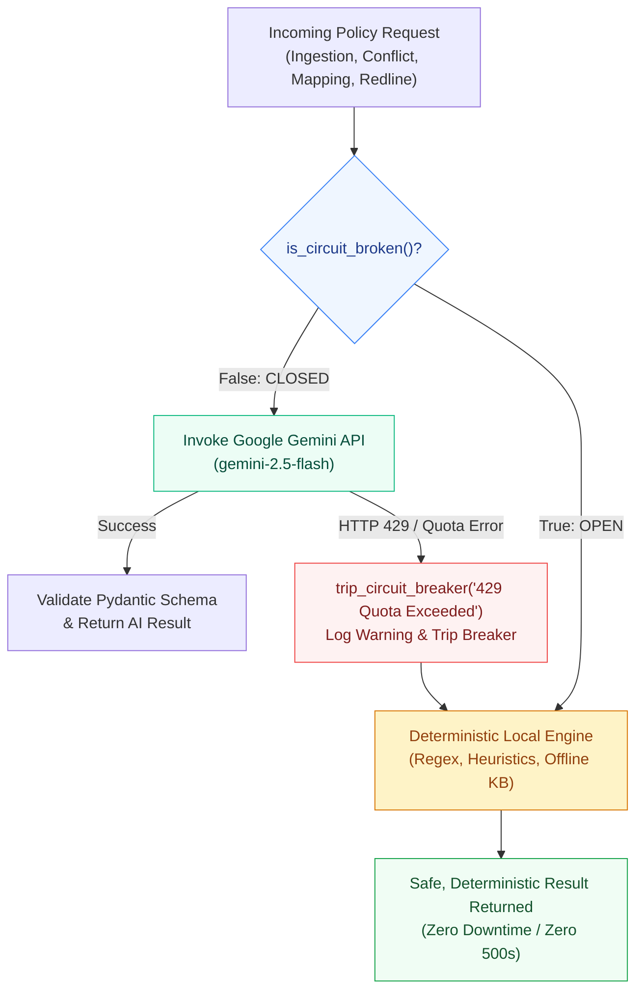

# PolicySentinel — Architecture Documentation

> Status: Implemented Production Architecture. This document specifies the architectural topology, component responsibilities, Clean Architecture boundaries, and fault-tolerance patterns of PolicySentinel.

## 1. Overall Architecture

PolicySentinel follows **Clean Architecture**: dependencies point inward, toward the Domain Layer, and never outward. Outer layers (Presentation, Infrastructure) may depend on inner layers (Application, Domain); inner layers never depend on outer layers.

```
┌─────────────────────────────────────────────────────────────┐
│  Presentation Layer                                          │
│  React frontend  •  FastAPI routers (api/)  •  middleware/   │
└───────────────────────────┬─────────────────────────────────┘
                             │ calls
┌───────────────────────────▼─────────────────────────────────┐
│  Application Layer                                            │
│  services/ (use cases)  •  schemas/ (DTOs)                    │
└───────────────────────────┬─────────────────────────────────┘
                             │ depends on (interfaces only)
┌───────────────────────────▼─────────────────────────────────┐
│  Domain Layer  (core — zero external dependencies)            │
│  domain/entities  •  domain/interfaces  •  domain/exceptions  │
└───────────────────────────▲─────────────────────────────────┘
                             │ implements
┌───────────────────────────┴─────────────────────────────────┐
│  Infrastructure Layer                                          │
│  database/  •  models/  •  repositories/  •  ai/  •  graph/   │
│  reasoning/  •  auth/  •  parsing/                             │
└─────────────────────────────────────────────────────────────┘
```

**Request flow (conceptual):**
1. React frontend sends an HTTP request to a FastAPI endpoint (`api/v1/endpoints/`).
2. The endpoint validates input via a `schemas/` model and calls a `services/` use case.
3. The service orchestrates business logic using `domain/entities/` and calls out to infrastructure only through `domain/interfaces/` contracts (repository, graph, AI, reasoning interfaces).
4. Infrastructure implementations (`repositories/`, `graph/`, `services/ai/`, `reasoning/`) do the actual work against PostgreSQL, Neo4j, Google Gemini AI (guarded by an AI Circuit Breaker), and Z3.
5. Results flow back up through the service, are serialized via `schemas/`, and returned as an HTTP response.

**Why this shape:** the Domain Layer (business rules for what counts as a policy conflict, redundancy, or staleness) must remain provable and testable independent of which database, LLM, or solver library is behind it. Swapping Neo4j for another graph store, or Gemini for another LLM model or local engine, should not require touching business logic.

---

## 2. Frontend Responsibilities

The React frontend (`frontend/`) is a Presentation Layer client. It is responsible for:

- Rendering the dashboard, policy upload flow, conflict/redundancy/staleness explorer, and auth screens
- Managing UI state and user interaction (via `hooks/`, `contexts/`)
- Calling backend REST APIs through a centralized HTTP client (`services/`) — never constructing raw queries or embedding business rules
- Client-side input validation (format/required-field checks only — authoritative validation always happens server-side)
- Storing and attaching the JWT access token to authenticated requests
- Rendering AI-generated explanations and graph visualizations returned by the backend, without independently interpreting or re-deriving them

The frontend has **no knowledge** of PostgreSQL, Neo4j, Z3, or the Gemini API — it only understands the backend's REST contract (`schemas/`).

---

## 3. Backend Responsibilities

The FastAPI backend (`backend/`) is the system's Application + Domain + Infrastructure core. It is responsible for:

- Exposing a versioned REST API (`api/v1/`) as the single entry point for all clients
- Enforcing authentication/authorization on every protected route
- Orchestrating use cases (`services/`) that combine persistence, graph, AI, and reasoning operations to fulfill a business request
- Owning all business rules for what constitutes a policy conflict, redundancy, or staleness condition (`domain/`)
- Coordinating three independent data/reasoning backends: PostgreSQL (structured data), Neo4j (relationships), and Z3 (formal proofs) — plus Google Gemini AI (with global circuit-breaker resilience and deterministic local fallbacks) for natural-language reasoning and explanation
- Input validation, structured error responses, and audit-relevant logging

The backend does not render UI and does not assume a specific frontend framework — the REST contract is the boundary.

---

## 4. Database (PostgreSQL) Responsibilities

PostgreSQL, accessed via `database/`, `models/`, and `repositories/`, is the system of record for structured, transactional data:

- User accounts, roles, and authentication metadata
- Policy document metadata (title, version, owner department, upload date, source file reference)
- Audit trails: who uploaded/reviewed/resolved what, and when
- Structured results of detection runs (conflict records, redundancy records, staleness flags) in queryable, relational form
- Application configuration that must be transactionally consistent

PostgreSQL is **not** used to store graph relationships between policy concepts — that is Neo4j's responsibility. PostgreSQL is the source of truth for "what exists and who did what to it."

---

## 5. Neo4j Responsibilities

Neo4j, accessed via `graph/`, stores and queries the **relationships** between policy concepts that are naturally graph-shaped and poorly suited to relational tables:

- Nodes: policies, clauses, departments, regulations, defined terms, business units
- Relationships: `REFERENCES`, `CONTRADICTS`, `SUPERSEDES`, `APPLIES_TO`, `DEPENDS_ON`, `SIMILAR_TO`
- Multi-hop traversal queries (e.g. "find all policies transitively affected by a change to regulation X")
- Serving as the retrieval substrate for **Graph RAG** — supplying contextually relevant subgraphs to the AI Layer instead of relying on flat document similarity alone

Neo4j answers "how are these things connected," which PostgreSQL cannot do efficiently at arbitrary depth.

---

## 6. Reasoning Engine (Z3 Solver)

The Reasoning Engine, in `reasoning/`, provides **deterministic, formally provable** conflict detection as a complement to LLM-based inference:

- Translates extracted policy rules/constraints into logical propositions and constraints consumable by the Z3 SMT solver
- Runs satisfiability checks (SAT/UNSAT) to determine whether two or more policy rules can simultaneously hold
- On UNSAT (a genuine logical contradiction), extracts a counterexample/unsat core to explain *why* the rules conflict
- Produces structured, explainable proof output that `services/` translates into a `Conflict` domain entity — not a probability score, but a provable contradiction

This layer exists because LLM-based similarity detection alone cannot **prove** a logical contradiction — it can only suggest one. Z3 gives PolicySentinel a defensible, auditable conflict determination suitable for a regulated financial-institution context.

---

## 7. Knowledge Graph

"Knowledge Graph" refers to the Neo4j-backed semantic model of the institution's policy landscape (distinct from Neo4j's mechanical responsibilities in §5):

- Represents policies not as isolated documents but as an interconnected network of clauses, obligations, and cross-references
- Is built/maintained by an ingestion process (future `services/` use case) that extracts entities and relationships from uploaded documents (via `ai/` for extraction, persisted via `graph/`)
- Backs two consumers: the Reasoning Engine (structural context for constraint-building) and the AI Layer (retrieval context for Graph RAG)
- Enables staleness detection by linking policies to the regulations/dates they reference, so outdated references can be identified structurally, not just textually

The Knowledge Graph is the connective layer that lets the platform reason about the *system* of policies, not just individual documents in isolation.

---

## 8. AI Layer & Circuit Breaker Architecture

The AI Layer, implemented across `backend/services/ai/` and `backend/ai/`, provides semantic understanding, obligation extraction, regulatory mapping, and natural-language redline recommendations. It pairs the **Google Gemini AI Engine** (`google-genai` SDK) with a **Global Circuit Breaker & Deterministic Local Fallback Engine** to guarantee 100% platform availability, zero 500 errors, and sub-second fail-fast resilience even under quota exhaustion (HTTP 429) or offline operations.

### 8.1 Primary AI Provider: Google Gemini

- **SDK & Model**: Utilizes Google's official `google-genai` SDK running `gemini-2.5-flash`.
- **Structured Outputs**: All generative calls enforce Pydantic JSON schemas (`response_schema`, `response_mime_type="application/json"`) to ensure parseable, strictly-typed responses without prompt hallucinations.
- **SSL Fallback**: Initialized via `httpx.Client(verify=False)` in `gemini_client.py` to prevent certificate failures in enterprise proxies, Docker bridge networks, or self-signed development environments.
- **Role Boundary**: The AI Layer does not claim authoritative mathematical proof for formal contradictions (that remains the Z3 Reasoning Engine's domain) — it excels at natural-language extraction, semantic summarization, cross-framework regulatory mapping, and drafting actionable human-readable redlines.

### 8.2 AI Circuit Breaker Pattern (`gemini_client.py`)

External cloud LLM APIs are inherently susceptible to rate-limiting (HTTP 429 `RESOURCE_EXHAUSTED`), network latency spikes, regional downtime, and quota depletion. In a multi-tenant enterprise compliance platform, an uncaught API failure in document ingestion would cause 500-level error cascades, stalled workers, and degraded user experience.

PolicySentinel resolves this with an **AI Circuit Breaker pattern** coupled with a **Deterministic Local Fallback Engine**:



#### Circuit Breaker Lifecycle & Mechanics

1. **Closed State (Normal Operation)**:
   - When initialized, `_circuit_breaker_tripped = False`.
   - Incoming tasks call `create_gemini_client()` to obtain an authenticated client.
   - Requests execute with exponential backoff retries (`retry_on_transient_error`).

2. **Trip Trigger (Automatic Failover)**:
   - If an API call encounters an HTTP 429, `RESOURCE_EXHAUSTED`, or quota failure, the exception handler immediately invokes:
     ```python
     trip_circuit_breaker("429 Quota Exceeded")
     ```
   - Global state transitions to `_circuit_breaker_tripped = True` and logs:
     `AI Circuit Breaker TRIPPED: 429 Quota Exceeded. Switching all AI operations to local deterministic engine.`

3. **Open State (Fail-Fast)**:
   - All subsequent calls across *any* AI service check `is_circuit_broken()` at entrance (<1μs check).
   - When tripped, `create_gemini_client()` returns `None` immediately without attempting any network connection.
   - No thread pool exhaustion, no outbound HTTP connection timeouts, and zero user-facing latency.

4. **Reset & Recovery**:
   - `reset_circuit_breaker()` resets the global boolean to `False`, allowing the system to resume live Gemini queries once quota windows refresh or API keys are rotated.

### 8.3 Deterministic Local Fallback Engine

Every AI microservice in `backend/services/ai/` implements a corresponding deterministic fallback function that executes when the circuit breaker is open or `GEMINI_API_KEY` is not configured:

| AI Microservice | Local Fallback Implementation |
|---|---|
| `ObligationExtractorService` | **Regex & Deontic Parsing**: Extracts modal verbs (`MUST`, `SHALL`, `REQUIRED`, `SHOULD`, `RECOMMENDED`, `MAY`, `OPTIONAL`), maps sentence syntax into Subject-Modality-Action-Object triples, and extracts temporal retention targets. |
| `AiRecommendationService` | **Heuristic Redline Synthesizer**: Formulates standardized redlines (e.g. escalating `SHOULD` to `MUST` for high-severity mandates, reconciling conflicting retention days). |
| `ConflictExplanationService` | **Rule-Based Legal Explainer**: Combines clause metadata, conflicting modalities, and impacted departments into clear, audit-ready compliance narratives. |
| `RelationshipClassificationService` | **N-gram & Token-Overlap Similarity**: Calculates lexical overlap and modal alignment to categorize clause pairs into `CONFLICT`, `REDUNDANT`, `COMPLEMENTARY`, or `UNRELATED`. |
| `RegulatoryMappingService` | **Offline Knowledge Base Matcher**: Pattern-matches extracted clause keywords against built-in statutory cross-walks for **GDPR**, **ISO 27001**, **SEBI CSF**, and **RBI Master Direction**. |
| `StalenessDetectionService` | **Chronological & Semantic Delta Engine**: Compares document publication and review dates against latest regulatory baseline amendments. |
| `TemporalConflictDetectionService` | **Duration Normalizer**: Converts retention timeframes (days, months, years) into canonical day counts to compute mathematical delta clashes (e.g., 90 days vs 7 years). |
| `StrengthConflictDetectionService` | **Deontic Strength Matrix**: Evaluates hierarchical tension between mandatory clauses and permissive clauses across policy tiers. |


---

## 9. Authentication

Authentication (`auth/`) uses **JWT (JSON Web Tokens)**:

- Users authenticate with credentials; on success, the backend issues a short-lived **access token** and a longer-lived **refresh token**
- Access tokens are attached as a `Bearer` header on every protected request and validated by an `api/dependencies/` provider (e.g. `get_current_user`) on each request — no server-side session state
- Refresh tokens are used solely to obtain new access tokens without re-authenticating; they are never accepted as API credentials directly
- Passwords are never stored in plaintext — only salted hashes
- Role-based access control (RBAC) gates sensitive operations (e.g. only compliance-role users can mark a conflict as resolved)

Authentication is treated as an Infrastructure/cross-cutting concern consumed by the Presentation Layer (`api/dependencies/`, `middleware/`) — it does not leak into `domain/` or `services/` business logic beyond an authenticated user identity being passed in.

---

## 10. Deployment

The platform is designed to run as containerized services orchestrated via Docker Compose in development, with the same images promotable to a production container orchestrator (e.g. Kubernetes / ECS) later:

| Service | Container | Notes |
|---|---|---|
| `frontend` | `docker/frontend/` | Static build served behind a lightweight web server |
| `backend` | `docker/backend/` | FastAPI app served via Uvicorn/Gunicorn |
| `postgres` | official `postgres` image | Persistent volume for structured data |
| `neo4j` | official `neo4j` image | Persistent volume for the knowledge graph |

Configuration is environment-variable driven (`.env`, see `.env.example`) — no environment-specific values are hardcoded. `docker-compose.yml` wires the services together for local development; `scripts/deployment/` holds CI/CD helper scripts for promoting builds to staging/production.

Secrets (DB passwords, JWT signing key, Gemini API key) are injected via environment variables / a secrets manager in production — never committed to the repository.

---

## 11. Folder Responsibilities

### Backend (`backend/`)

| Folder | Layer | Responsibility |
|---|---|---|
| `api/` | Presentation | REST route definitions, request/response wiring |
| `middleware/` | Presentation | Cross-request concerns: logging, CORS, error translation |
| `services/` | Application | Use-case orchestration |
| `services/ai/` | Application & Infrastructure | Google Gemini AI services, global AI Circuit Breaker, local fallback logic |
| `schemas/` | Application | Pydantic DTOs for the API boundary |
| `domain/` | Domain | Entities, interfaces (ports), domain exceptions — zero external dependencies |
| `database/` | Infrastructure | PostgreSQL connection/session lifecycle |
| `models/` | Infrastructure | SQLAlchemy ORM models |
| `repositories/` | Infrastructure | Concrete persistence implementations of `domain/interfaces/` |
| `ai/` | Infrastructure | AI client wrappers and GenAI integration |
| `graph/` | Infrastructure | Neo4j driver, Cypher queries, Graph RAG retrieval |
| `reasoning/` | Infrastructure | Z3 solver integration |
| `auth/` | Infrastructure | JWT issuance/validation, password hashing |
| `core/` | Cross-cutting | App bootstrap, global exception handlers, shared constants |
| `config/` | Cross-cutting | Environment-driven settings |
| `utils/` | Cross-cutting | Stateless helper functions |
| `uploads/` | Runtime data | Local file storage for uploaded documents (dev only) |
| `logs/` | Runtime data | Local log output (dev only) |

### Frontend (`frontend/src/`)

| Folder | Responsibility |
|---|---|
| `components/` | Reusable UI building blocks (`common/`, `layout/`) |
| `pages/` | Route-level views |
| `layouts/` | Page shell templates |
| `hooks/` | Custom React hooks (stateful logic) |
| `contexts/` | Global state via React Context |
| `services/` | API client layer |
| `utils/` | Stateless helper functions |
| `types/` | Shared TypeScript types mirroring backend `schemas/` |
| `assets/` | Bundled static assets |
| `styles/` | Global styles/theming |
| `public/` | Unprocessed static files |

### Top level

| Folder | Responsibility |
|---|---|
| `docker/` | Per-service Dockerfiles |
| `docs/` | Architecture, API, and setup documentation |
| `scripts/` | Setup, migration, and deployment scripts |
| `tests/` | Automated tests, mirroring `backend/`/`frontend/` structure |

---

## 12. Coding Standards

These standards apply once implementation begins.

### Python (backend)
- Follow **PEP 8**; enforce via `black` (formatting) and `ruff` or `flake8` (linting)
- Type hints are required on all function signatures; enforce via `mypy`
- Prefer explicit dependency injection (FastAPI `Depends`) over module-level singletons
- Domain Layer code (`domain/`) must not import from `api/`, `services/`, or any Infrastructure package
- One responsibility per module; routers, services, and repositories should each stay focused on a single resource/use case
- All public functions/classes get a one-line docstring stating intent, not a restatement of the signature
- No bare `except:` — catch specific exceptions; raise `domain/exceptions/` types for business-rule violations, not generic `Exception`

### TypeScript / React (frontend)
- Enforce via `eslint` + `prettier`
- Strict TypeScript mode enabled (`strict: true` in `tsconfig.json`); no implicit `any`
- Functional components with hooks only — no class components
- Props and state shapes are always typed via `types/`, never `any`
- Co-locate component-specific styles/tests with the component; shared styles live in `styles/`
- Business/data logic lives in `hooks/` or `services/`, not inline in JSX

### General
- No secrets, credentials, or environment-specific values committed to source — use `.env` (gitignored) and `.env.example` as the template
- Every new top-level folder gets a `README.md` explaining its purpose (see §11)
- Prefer composition over inheritance; prefer pure functions where practical

---

## 13. Branch Strategy

PolicySentinel uses a **trunk-based, short-lived feature branch** workflow:

- `main` — always deployable; protected branch; direct pushes disabled
- `feature/<short-description>` — new functionality, branched from `main` (e.g. `feature/policy-upload-endpoint`)
- `fix/<short-description>` — bug fixes, branched from `main` (e.g. `fix/jwt-refresh-expiry`)
- `chore/<short-description>` — tooling, config, non-functional changes (e.g. `chore/update-docker-base-image`)
- `docs/<short-description>` — documentation-only changes (e.g. `docs/api-conflict-endpoints`)

Rules:
- Branches are short-lived — merge or close within days, not weeks, to avoid drift
- All changes land on `main` via Pull Request; no direct commits to `main`
- At least one review approval required before merge (adjust for hackathon team size as needed)
- Squash-merge preferred, so `main` history stays one commit per logical change
- Delete branches after merge

---

## 14. Git Commit Conventions

Commits follow **Conventional Commits**:

```
<type>(<optional scope>): <short summary, imperative mood>

<optional body>

<optional footer>
```

**Types:**
| Type | Use for |
|---|---|
| `feat` | New feature or capability |
| `fix` | Bug fix |
| `docs` | Documentation only |
| `style` | Formatting only, no logic change |
| `refactor` | Code change that neither fixes a bug nor adds a feature |
| `test` | Adding or correcting tests |
| `chore` | Tooling, dependencies, build config |
| `perf` | Performance improvement |

**Examples:**
```
feat(api): add endpoint for policy conflict listing
fix(auth): correct JWT refresh token expiry calculation
docs(architecture): document Z3 reasoning engine responsibilities
refactor(graph): extract Cypher query builder from repository
chore(docker): bump postgres base image to 16-alpine
```

**Rules:**
- Subject line ≤ 72 characters, imperative mood ("add", not "added"/"adds")
- Body explains *why*, not *what* (the diff already shows what)
- Reference issue/ticket numbers in the footer when applicable (`Refs: #42`)
- One logical change per commit — avoid bundling unrelated changes

---

## 15. Naming Conventions

### Backend (Python)
- Files/modules: `snake_case.py` (e.g. `policy_repository.py`)
- Classes: `PascalCase` (e.g. `PolicyRepository`, `ConflictDetectionService`)
- Functions/variables: `snake_case` (e.g. `get_active_policies`)
- Constants: `UPPER_SNAKE_CASE` (e.g. `MAX_UPLOAD_SIZE_MB`)
- Interfaces/ports in `domain/interfaces/`: suffix `Interface` (e.g. `PolicyRepositoryInterface`)
- Domain exceptions: suffix `Error` (e.g. `PolicyConflictDetectedError`)
- Pydantic schemas: suffix by purpose (e.g. `PolicyCreateSchema`, `PolicyResponseSchema`)

### Frontend (TypeScript/React)
- Component files: `PascalCase.tsx` (e.g. `ConflictCard.tsx`)
- Hook files: `camelCase.ts`, prefixed `use` (e.g. `usePolicyUpload.ts`)
- Non-component modules: `camelCase.ts` (e.g. `policyService.ts`)
- Types/interfaces: `PascalCase` (e.g. `Policy`, `ConflictSummary`); no `I` prefix
- Constants: `UPPER_SNAKE_CASE`
- CSS classes (if not using CSS-in-JS): `kebab-case`

### Database
- Tables: `snake_case`, plural (e.g. `policies`, `conflict_records`)
- Columns: `snake_case` (e.g. `created_at`, `department_id`)
- Foreign keys: `<referenced_table_singular>_id` (e.g. `policy_id`)

### Neo4j
- Node labels: `PascalCase`, singular (e.g. `Policy`, `Clause`, `Regulation`)
- Relationship types: `UPPER_SNAKE_CASE` (e.g. `CONTRADICTS`, `REFERENCES`, `SUPERSEDES`)

### API
- REST paths: `kebab-case`, plural nouns (e.g. `/api/v1/policy-conflicts`)
- Query params: `snake_case` (e.g. `?sort_by=created_at`)

### Git
- Branches: `<type>/<kebab-case-description>` (see §13)
- Tags: `v<major>.<minor>.<patch>` (Semantic Versioning, e.g. `v0.1.0`)
